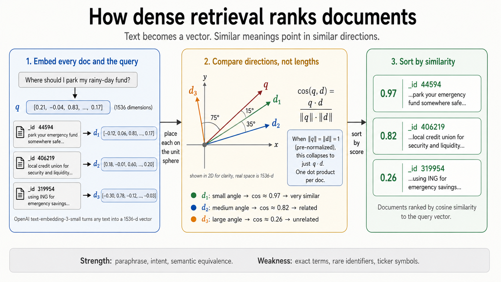
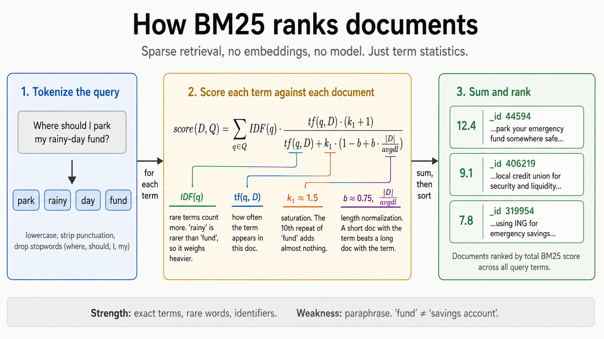
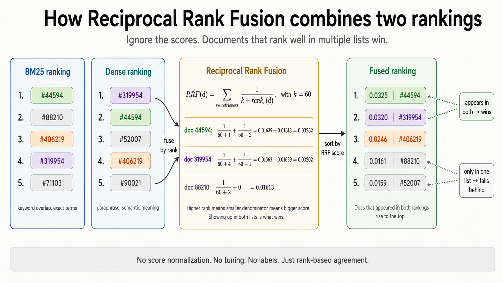

*This project has been created as part of the 42 curriculum by vhedo-ga.*

# 🛡️ RAG Against the Machine

> **Will you answer my questions?**

**RAG Against the Machine** is a Retrieval-Augmented Generation engine built from
scratch in Python for the 42 Madrid AI curriculum. It indexes the vLLM codebase,
retrieves the most relevant source locations for a question, and gives a local
language model the evidence it needs to generate a grounded answer.

This is not a wrapper around LangChain or another high-level orchestration
framework. The indexing, lexical retrieval, dense retrieval, rank fusion,
character-range evaluation, CLI orchestration, and infrastructure controls are
implemented as explicit, inspectable components.

The project was completed in **90 hours**, against an initial 150-hour
expectation. The result is a deliberately transparent system: every retrieved
source is traceable to an exact file and character interval.


## Description

### The problem

A language model is frozen at the end of its training data. Asking it about a
private repository or a recently changed library can produce a confident
hallucination. RAG solves this by retrieving external evidence at query time and
placing that evidence in the model context before generation.

The pipeline follows four stages:

1. **Index** the source corpus into searchable representations.
2. **Retrieve** the best code and documentation fragments for a question.
3. **Augment** the prompt with the retrieved source context.
4. **Generate** a local answer with `Qwen/Qwen3-0.6B`.


### Project goals

- Reach the subject thresholds of **Recall@5 > 80% on documentation** and
  **Recall@5 > 50% on code**.
- Keep every result valid for the evaluator: exact corpus paths and character
  ranges no larger than the configured 2,000-character limit.
- Run locally on CPU-friendly infrastructure without hiding retrieval decisions
  behind a high-level framework.
- Make the system reproducible with `uv`, Python Fire, Pydantic models and a
  Makefile.

## ⚙️ System Architecture

```text
data/raw/vllm-0.10.1/
          │
          ▼
┌──────────────────────┐
│ Structure-aware      │
│ chunking             │
│ Python AST + Markdown│
└──────────┬───────────┘
           │ (file_path, first_character_index, last_character_index)
           ▼
┌──────────────────────┐       ┌──────────────────────┐
│ Dense encoder        │       │ Custom BM25           │
│ Hugging Face model   │       │ implemented in Python │
└──────────┬───────────┘       └──────────┬───────────┘
           │                              │
           └──────────────┬───────────────┘
                          ▼
             Reciprocal Rank Fusion (RRF)
                          │
                          ▼
             Pydantic search result JSON
                          │
                          ▼
             Qwen/Qwen3-0.6B grounded answer
```

### 1. Structure-aware ingestion and chunking

The `SuperChunker` uses different strategies for different source languages:

- **Python:** the file is parsed with the standard-library `ast` module.
  Imports, functions, classes and other top-level nodes become natural
  boundaries. An oversized node is recursively split on newline boundaries,
  never exceeding the configured `--max_chunk_size`.
- **Markdown:** the `md_chunkeator` starts with paragraph separators. Large
  paragraphs are split around punctuation or newlines before falling back to a
  hard boundary.

Each chunk is stored as an exact character interval:

```text
(file_path, first_character_index, last_character_index)
```

This preserves source traceability. The retriever does not return an invented
copy of a passage; it returns a location that can be reopened from the original
corpus. Markdown is lightly normalized only for dense encoding (markup, URLs
and fenced code are removed), while the original source ranges remain intact.

### 2. Hybrid retrieval: two search engines, one signal

The retrieval layer deliberately combines complementary representations.

#### Dense semantic retrieval

Chunks and questions are encoded with a Hugging Face Sentence Transformer
(`TaylorAI/bge-micro-v2` in the current implementation). Embeddings are
L2-normalized, so the matrix product

```text
similarity(query, chunk) = normalized_query · normalized_chunk
```

is cosine similarity. This path catches paraphrases: a question and a source
can be semantically close even when they do not share the same words.

#### Custom BM25 from first principles

The lexical path is a custom BM25 implementation, not a black-box search
service. Tokenization keeps identifiers useful by splitting words such as
`max_context_length` and CamelCase into searchable sub-parts.

For a term `t` in document `d`, the score uses:

```text
BM25(t, d) = IDF(t) *
             [ tf(t,d) * (k1 + 1) ] /
             [ tf(t,d) + k1 * (1 - b + b * |d| / avgdl) ]
```

with `k1 = 1.2`, `b = 0.75`, and:

```text
IDF(t) = log(((N - df(t) + 0.5) / (df(t) + 0.5)) + 1)
```

BM25 is especially effective when a question quotes an exact function name,
flag, configuration key or code identifier.

#### Reciprocal Rank Fusion

Dense and lexical scores are not directly comparable, so the system fuses their
rankings rather than pretending that their raw values have the same meaning.
For each candidate at rank `r`, RRF contributes:

```text
RRF(document) = Σ weight_i / (60 + rank_i + 1)
```

The current hybrid weighting gives BM25 a `1.9` weight and dense retrieval a
`1.0` weight. A document ranked well by either engine receives signal; a
document ranked well by both gets the strongest combined position. This is the
black-magic layer that turns exact identifier matching and semantic similarity
into one robust ranking.

### 3. Augmentation and generation

The selected source locations are unpacked from the original files and passed
as context to `Qwen/Qwen3-0.6B`. Search and answer stages exchange validated
Pydantic models, including `MinimalSource`, `MinimalSearchResults`,
`StudentSearchResults`, `MinimalAnswer` and
`StudentSearchResultsAndAnswer`.

The output is therefore both human-readable and machine-checkable:

```json
{
  "file_path": "data/raw/vllm-0.10.1/docs/features/lora.md",
  "first_character_index": 9867,
  "last_character_index": 10100
}
```

## 📊 Evaluation and Performance

### Recall@k

For each question, Recall@k is the fraction of its ground-truth sources found
in the first `k` retrieved results:

```text
Recall@k(question) =
    correct sources retrieved in top-k
    ---------------------------------
          total ground-truth sources
```

The final score is the mean over the evaluation questions.

### Character-range IoU

A retrieved source counts as correct only when:

1. `file_path` matches exactly; and
2. its character range overlaps the ground-truth range enough.

The evaluator computes Intersection over Union over character intervals:

```text
intersection = max(0, min(student_end, truth_end)
                      - max(student_start, truth_start))

union = student_length + truth_length - intersection

IoU = intersection / union
```

The overlap threshold is **IoU >= 0.05**. This is intentionally tolerant of
different but useful chunk boundaries while still requiring the correct file
and a meaningful region of it.

The validator was implemented from scratch. Ground-truth sources are indexed
by `question_id` in dictionaries, giving O(1) lookup per question and avoiding
an unnecessary O(N²) search through the complete dataset. The retrieval
targets defined by the subject are:

| Corpus | Required Recall@5 |
|---|---:|
| Documentation | **> 80%** |
| Code | **> 50%** |

The subject also requires indexing the complete corpus in at most five minutes
and processing 200 retrieval questions in at most 90 seconds. The `tqdm`
progress bars make long-running indexing and batch operations observable rather
than opaque.

## 🧠 Design Decisions

| Decision | Rationale |
|---|---|
| AST-aware Python chunks | Keeps functions, classes and imports semantically coherent. |
| Paragraph-aware Markdown chunks | Preserves headings, prose and nearby context. |
| Character offsets instead of copied snippets | Matches the Moulinette contract exactly and keeps results auditable. |
| Custom BM25 | Demonstrates lexical retrieval mechanics and protects identifier search. |
| Normalized dense vectors | Makes dot products equivalent to cosine similarity. |
| RRF instead of raw-score addition | Combines rankings with incompatible score scales safely. |
| Pydantic data models | Validates every boundary between indexing, retrieval, evaluation and generation. |
| `uv` + local caches | Reproducible dependency management without filling the campus HOME quota. |

## 🛠️ Solving `Disk Quota Exceeded` at 42

The 42 environment has a strict quota on `HOME`. Hugging Face models,
transformers metadata and `uv` wheels can consume that quota quickly and make a
working pipeline crash before retrieval starts.

The infrastructure solution is to redirect heavyweight state to the fast local
student partition. The Makefile exposes the cache variables used by this
deployment profile; when they are not already exported by the shell or a local
`.env` loader, set them explicitly:

```bash
export RAG_CACHE_ROOT="/sgoinfre/students/${USER}/rag"
export HF_HOME="${RAG_CACHE_ROOT}/hf_cache"
export TRANSFORMERS_CACHE="${HF_HOME}"
export HUGGINGFACE_HUB_CACHE="${HF_HOME}"
export UV_CACHE_DIR="${RAG_CACHE_ROOT}/uv_cache"
export VENV_DIR="${RAG_CACHE_ROOT}/venv"
```

The Makefile is the operational guardrail: `install` provisions the virtual
environment and dependency cache outside `HOME`, while `run` exports the
Hugging Face cache variables before loading models. On a fresh 42 machine,
adapt the commented cache variables in the Makefile or export the equivalent
paths in the shell before invoking it. Generated indexes and answers stay in
`data/processed/` and `data/output/`, both of which are removed by `clean`.

## 🚀 Instructions

### Requirements

- Python 3.10 or newer
- `uv`
- A CPU-capable Python environment (CUDA is disabled by the default run path)
- The provided vLLM corpus under `data/raw/vllm-0.10.1/`
- Public question datasets under `data/datasets_public/` or the layout supplied
  by the evaluator

### Quickstart

Install dependencies and create the environment:

```bash
make install
```

Run the complete indexing, retrieval, answer-generation and evaluation flow:

```bash
make run
```

Run the required CLI stages individually:

```bash
# Build data/processed/hybrid_index.pkl
uv run python -m src index --max_chunk_size 2000

# Search one query
uv run python -m src search_single_query \
  --query "How can you limit compilation jobs when building vLLM?" \
  --k 10

# Search a complete dataset
uv run python -m src search_dataset \
  --dataset_path data/datasets/UnansweredQuestions/dataset_docs_public.json \
  --k 10 \
  --save_directory data/output/search_results/UnansweredQuestions

# Generate grounded answers from search results
uv run python -m src answer_dataset \
  --student_search_results_path \
  data/output/search_results/UnansweredQuestions/dataset_docs_public.json \
  --save_directory data/output/search_results_and_answer/UnansweredQuestions

# Run the local evaluator
uv run python -m src evaluate \
  --student_search_results_path \
  data/output/search_results/UnansweredQuestions/dataset_docs_public.json \
  --dataset_path data/datasets/AnsweredQuestions/dataset_docs_public.json
```

### Makefile commands

| Command | Purpose |
|---|---|
| `make install` | Install dependencies with `uv` using the configured external cache. |
| `make run` | Execute the end-to-end index, search, answer and evaluation flow. |
| `make debug` | Launch the pipeline under Python's built-in `pdb` debugger. |
| `make clean` | Remove generated indexes, outputs, bytecode and type-checker caches. |
| `make lint` | Run Flake8 and Mypy with the subject's required flags. |

## 📁 Repository Layout

```text
.
├── src/
│   ├── chunkers.py       # AST and Markdown chunking
│   ├── encode_all.py     # Dense encoder and custom BM25
│   ├── search_index.py   # Index persistence, retrieval and RRF
│   ├── utils.py          # Source unpacking and IoU evaluation
│   └── pipeline.py       # Fire CLI orchestration
├── data/
│   ├── raw/              # Input corpus, not generated by the project
│   ├── processed/        # Persisted retrieval index
│   └── output/           # Search and answer JSON files
├── Makefile
├── pyproject.toml
├── uv.lock
└── README.md
```

## ⚠️ Challenges Faced

### Preserving meaning while respecting 2,000 characters

Naive fixed-width slicing breaks functions, paragraphs and explanations at
arbitrary points. The two chunkers preserve natural boundaries first and only
fall back to newline, punctuation or fixed-size cuts when a segment is too
large.

### Matching code questions and documentation questions

Lexical matching is excellent for identifiers but weak on paraphrases; dense
matching has the opposite profile. The hybrid ranker and RRF fusion make those
signals reinforce each other instead of forcing one representation to solve
every query.

### Operating under a hostile disk budget

Model weights and caches are large enough to exhaust `HOME` on 42's machines.
Cache redirection is treated as part of the application design, not as a
manual afterthought. Reproducible `uv` commands and Makefile targets make the
environment portable between local development and the campus infrastructure.

## Resources

### Technical references

- 42 subject: *RAG against the machine*, version 2.0 (provided with the
  project materials)
- [Sentence Transformers documentation](https://www.sbert.net/)
- [Hugging Face Transformers documentation](https://huggingface.co/docs/transformers/)
- [BM25: Robertson and Zaragoza, The Probabilistic Relevance Framework](https://nlp.stanford.edu/IR-book/html/htmledition/the-probabilistic-relevance-framework-tfidf-1.html)
- [Reciprocal Rank Fusion](https://plg.uwaterloo.ca/~gvcormac/rrf.html)
- [Pydantic documentation](https://docs.pydantic.dev/)
- [uv documentation](https://docs.astral.sh/uv/)

### AI usage disclosure

AI tools were used as engineering assistance for repetitive and review-oriented
tasks: exploring documentation, checking edge cases, improving wording, and
reviewing the README structure against the 42 subject. The architecture,
chunking strategy, retrieval algorithms, IoU validator, CLI behavior and
infrastructure decisions remain the author's responsibility. Every generated
suggestion was inspected, adapted and validated against the source code and the
subject requirements.

## Author

**vhedo-ga** — 42 Madrid student focused on cybersecurity, systems engineering
and adversarial thinking. This project applies a Red Team mindset to AI
infrastructure: understand the assumptions, attack the failure modes, measure
the result, and keep control of the stack.